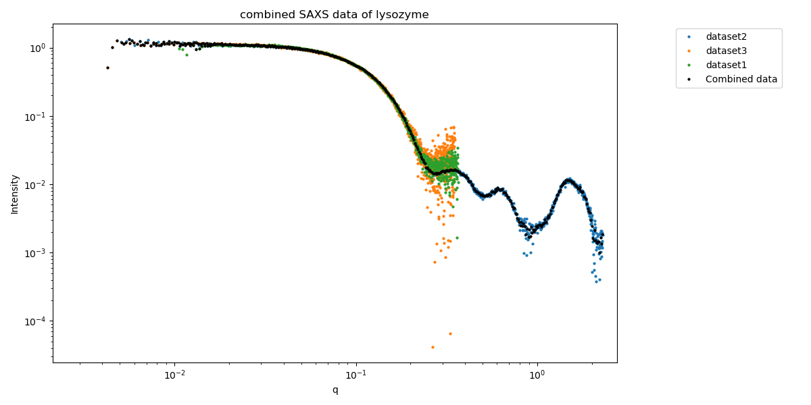

# ML-SAScombine
version beta0.18

ML-SAScombine applies maximum likelihood (ML) to combine multiple small-angle scattering (SAS) datasets into a consensus dataset   
The input could be, e.g., data measured on different instruments, or SAXS and WAXS data.   



## Installation
* install python3
* download mlsascombine.py and mlsascombine_functions.py from this repository (place both scripts in same folder on your computer)    
* install necessary python packages (see Dependencies)      

## Run  
To run ML-SAScombine, open a terminal (mac or linux) or command prompt (windows), and change directory to the directory where you saved mlsascombine.py and mlsascombine_functions.py:
```
cd <PATH-TO-DIRECTORY>
```

#### standard run for combining 3 datasets
This command combines the three datasets in the example folder of this directory (the example folder should be in the same directory as the two python scripts mlsascombin.py and mlsascombine_functions.py):    
```
python mlsascombine.py --path example_data/ --data "dataset1.dat dataset2.dat dataset3.dat" --title my_combined_data
```
#### alternative command for combining the 3 datasets
The output of this command is the same as above, but is more compact. It instructs ML-SAScombine to combine all datasets with extension (*.ext) in the folder example_data/ into a merged datafile:  
```
python mlsascombine.py --path example_data --ext dat --title my_combined_data
```
#### instructions and options
too display all possible options, type:    
```
python mlsascombine.py --help
```
## Dependencies

### dependencies from this folder:     
* mlsascombine_functions.py
(should be in the same folder as mlsascombine.py)    

### other dependencies (standard python packages):   
* argparse     
* numpy    
* matplotlib    
* os    
* shutil    
* math    
* scipy
* sys
* time

these can usually be added to your python environment by installing pip and running, e.g., pip install numpy (or pip3 install numpy)    

## GUI
We are working on making a GUI available, hence the folder GUI. However this is not available yet. 

## Limitations
* The program has only been tested on a limited number of datasets - so please assess the outcome critically. Feedback is more than welcome. Preferably via this GitHub page (under "Issues").    
* ML-SAScombine can combine SANS data, but resolution effects are not taken into account, which will inevitably lead to systematic errors.    

## Credit   
The program was written by Andreas Haahr Larsen   
Input and insight from Jochen Hub, Jill Trewhella and Patrice Vachette   
If you use ML-SAScombine in you work, please cite: Trewhella, Vachette, Larsen (2024) IUCrJ, in review   

## Release notes (from version beta0.15 and onwards)
* beta0.15:  adjusted default protocol for assigning background level.     
* beta0.16:  added option (-offset2 or --offset_option2) for an alternative protocol for assigning background levels. Not default.    
* beta0.17:  added option (-ga or --guinier_analysis). This option use autorg (from ATSAS) to normalize the merged curve with the forward scattering I(0). Requires that autorg is installad. Not default.
* beta0.18:  added option (-setb [float number] or --set_constant_background [float number]). This option sets the background level of the merged curve such that the lowest value is equal to the user input value. Default is 0.001.     
